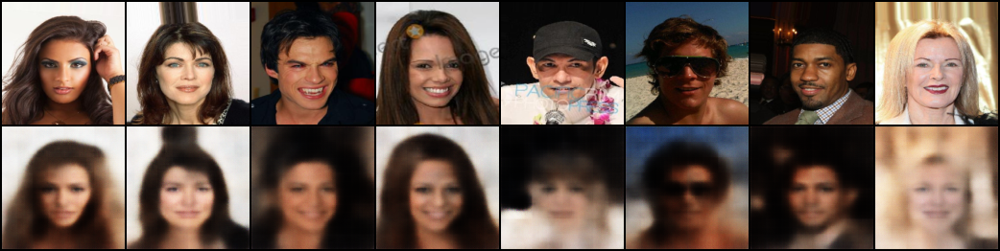
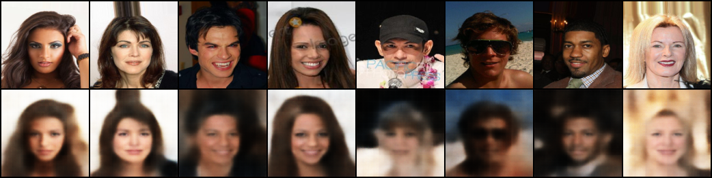
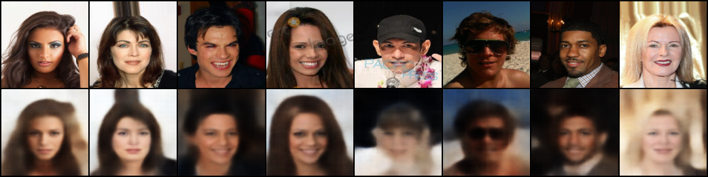

# VAE Training for CelebA

A **Variational Autoencoder (VAE)** implementation in PyTorch for generating and reconstructing face images from the CelebA dataset.
This repository provides a clean, modular pipeline with β‑annealing, checkpointing, and sample generation.

---

## 📋 Table of Contents
- [Features](#features)
- [Project Structure](#project-structure)
- [Requirements](#requirements)
- [Installation](#installation)
- [Usage](#usage)
  - [Training from Python](#training-from-python)
  - [Training from YAML config](#training-from-yaml-config)
  - [Custom Dataset Path](#custom-dataset-path)
- [Configuration Parameters](#configuration-parameters)
- [KL Annealing Modes](#kl-annealing-modes)
- [Outputs](#outputs)
- [Training Results (Proof of Concept)](#training-results-proof-of-concept)
- [Model Architecture](#model-architecture)
- [Troubleshooting](#troubleshooting)
- [Note!](#mote)
- [License](#license)

---

## ✨ Features
- **β‑VAE** loss with KL annealing for better disentanglement.
- **Optional capacity annealing** – a more robust alternative to raw β‑weighting (Burgess et al., 2018) that targets a specific KL "capacity" instead of a fixed loss weight.
- **KL plateau monitoring** – automatically warns you if the KL term stalls after annealing finishes, so a too‑weak β doesn't go unnoticed over a long run.
- **Dynamic encoder/decoder** – automatically adapts to image size and hidden dimensions.
- **Dataset caching** – specify a custom download location for the CelebA dataset.
- **Checkpointing** – saves the best model based on validation reconstruction loss (`val_recon`), tracked consistently across the entire run.
- **Reconstruction samples** – saved every epoch for visual monitoring.
- **Final generation** – produces new images from random latent vectors.
- **YAML support** – easily change hyperparameters without touching code.

---

## 📁 Project Structure
```
.
├── Train.py                    # Main training script
├── configs/
│   └── standard_config.yaml    # Example configuration file
├── src/
│   ├── model/
│   │   ├── VAE.py              # VAE model with loss function
│   │   ├── Encoder.py          # Encoder module
│   │   └── Decoder.py          # Decoder module
│   └── preprocess/
│       └── Preprocess.py       # Dataset handling and data loaders
├── checkpoints/                # Saved model checkpoints (auto‑created during training)
├── outputs/samples/            # Reconstruction and generation samples (auto‑created during training)
└── dataset/                    # Default dataset cache directory (auto‑created during dataset download)
└── LICENSE                     # MIT license
└── README.md
```

---

## 📦 Requirements
- Python 3.8+
- PyTorch ≥ 1.9.0
- torchvision
- datasets (Hugging Face)
- Pillow
- PyYAML
- matplotlib (optional, for `show_images` utility)

---

## ⚙️ Installation

1. **Clone the repository**.
```bash
https://github.com/TryingManV2/Vanilla-VAE-CelebA-Face-Generator.git
```
or
```bash
git@github.com:TryingManV2/Vanilla-VAE-CelebA-Face-Generator.git
```
2. **Install the required packages**:
   ```bash
   pip install torch torchvision datasets pillow pyyaml matplotlib
   ```

## 🚀 Usage

### Training from Python (I do not recommend this.)
```python
from src.Train import train

train(
    dataset="flwrlabs/celeba",
    cache_dir="./dataset",
    n_epochs=100,
    batch_size=32,
    img_size=128,
    latent_dim=128,
    beta=0.0005,
    learning_rate=1e-3,
    # optional: only needed if you want capacity annealing instead of raw beta
    use_capacity_annealing=False,
    capacity_target=25.0,
    capacity_anneal_epochs=40,
    capacity_gamma=100.0
)
```

### Training from YAML config (My recommendation!)
Create a YAML file (e.g., `configs/my_config.yaml`) with any of the training parameters:
```yaml
dataset: "flwrlabs/celeba"
cache_dir: ./dataset
n_epochs: 100
img_size: 128
batch_size: 32
num_workers: 4
pin_memory: True
shuffle: True
test_set: False
checkpoint_dir: "./checkpoints"
sample_dir: "./outputs/samples"
input_channels: 3
latent_dim: 128
hidden_dims: [32, 64, 128, 256, 512]
learning_rate: 1e-3
beta: 0.0005

# KL plateau monitoring (leave defaults unless you know you want to change them)
kl_plateau_check_start: 25
kl_plateau_window: 10
kl_plateau_min_drop_frac: 0.05

# Optional capacity-annealing mode (off by default — see "KL Annealing Modes" below)
use_capacity_annealing: False
capacity_target: 25.0
capacity_anneal_epochs: 40
capacity_gamma: 100.0
```
Then run:
```python
from src.Train import train_from_yaml
train_from_yaml("configs/my_config.yaml")
```

### Custom Dataset Path
The dataset will be downloaded to the directory specified by `cache_dir` (default: `"./dataset"`).
If you already have the dataset cached elsewhere, point `cache_dir` to that location to reuse it.

---

## ⚙️ Configuration Parameters

| Parameter          | Type     | Default                | Description |
|--------------------|----------|------------------------|-------------|
| `dataset`          | str      | `"flwrlabs/celeba"`    | Hugging Face dataset identifier. |
| `cache_dir`        | str      | `"./dataset"`          | Local directory to store the dataset. |
| `n_epochs`         | int      | `100`                  | Number of training epochs. |
| `img_size`         | int      | `128`                  | Input image size (square). |
| `batch_size`       | int      | `32`                   | Batch size for training and validation. |
| `num_workers`      | int      | `4`                    | DataLoader worker threads. |
| `pin_memory`       | bool     | `True`                 | Enables faster GPU data transfer. |
| `shuffle`          | bool     | `True`                 | Shuffle training data. |
| `test_set`         | bool     | `False`                | Whether to load the test set (not used in training). |
| `checkpoint_dir`   | str      | `"./checkpoints"`      | Where to save the best model. |
| `sample_dir`       | str      | `"./outputs/samples"`  | Where to save reconstruction & generated images. |
| `input_channels`   | int      | `3`                    | Number of image channels (RGB). |
| `latent_dim`       | int      | `128`                  | Dimensionality of the latent space. |
| `hidden_dims`      | list     | `[32,64,128,256,512]`  | Channels in each encoder/decoder layer. |
| `learning_rate`    | float    | `1e-3`                 | Adam learning rate. |
| `beta`             | float    | `0.0005`               | KL divergence weight (β‑VAE). Linearly annealed from 0 up to this value over the first 20 epochs. Used for the training loss; validation always uses the full target value so `val_loss` is comparable across epochs. |
| `kl_plateau_check_start` | int | `25`                | First epoch to start checking whether `val_kl` has plateaued (should be a few epochs after annealing finishes). |
| `kl_plateau_window`      | int | `10`                | Number of epochs back to compare against when checking for a KL plateau. |
| `kl_plateau_min_drop_frac` | float | `0.05`            | Minimum relative drop in `val_kl` required over the window to *not* be flagged as a plateau. |
| `use_capacity_annealing` | bool | `False`             | Switches the loss from raw β‑weighting to KL capacity annealing (see [KL Annealing Modes](#kl-annealing-modes)). |
| `capacity_target`       | float | `25.0`               | Target KL "capacity" (in nats) the model is allowed to use once annealing finishes. Only used when `use_capacity_annealing=True`. |
| `capacity_anneal_epochs`| int   | `40`                 | Number of epochs to linearly ramp the allowed capacity from 0 to `capacity_target`. |
| `capacity_gamma`        | float | `100.0`              | Fixed weight applied to `\|KL - capacity\|`. Kept large and constant, unlike β. |

> **Note on `beta` vs. image size / latent dimension:** the reconstruction term is averaged per-pixel while the KL term is summed over latent dimensions, so `beta=0.0005` was tuned specifically for `img_size=128` and `latent_dim=128`. If you change either of those, you may need to re-tune `beta` (or switch to `use_capacity_annealing`, which is more portable across configurations).

---

## 🎛️ KL Annealing Modes

This repo supports two ways of weighting the KL term, plus an automatic health check that helps you decide between them.

### 1. Standard β‑annealing (default)
`total_loss = recon_loss + beta * kl_loss`

`beta` is linearly ramped from 0 up to its target value over the first 20 epochs to avoid posterior collapse early in training. This is simple and works well once `beta` is tuned for your specific `img_size`/`latent_dim`, but the right value has to be found empirically and doesn't automatically transfer if you change the architecture.

### 2. Capacity annealing (optional, `use_capacity_annealing: True`)
`total_loss = recon_loss + capacity_gamma * |kl_loss - capacity|`

Instead of weighting KL indirectly with `beta`, this directly tells the model how much information (`capacity`, in nats) it's allowed to encode in the latent space, and ramps that allowance up over `capacity_anneal_epochs`. `capacity_gamma` stays large and fixed throughout training. This tends to be more robust across different image sizes and latent dimensions, at the cost of two new hyperparameters (`capacity_target`, `capacity_gamma`) that also need some tuning for your dataset.

**Use standard β‑annealing by default.** Only switch to capacity annealing if the automatic KL plateau check below flags a problem, or if you're experimenting with different `latent_dim`/`img_size` combinations and don't want to re-tune `beta` each time.

### KL plateau warning
Starting at epoch `kl_plateau_check_start` (default 25, a few epochs after β‑annealing ends at epoch 20), training checks whether `val_kl` has dropped by at least `kl_plateau_min_drop_frac` (default 5%) over the last `kl_plateau_window` epochs (default 10). If it hasn't, a one-time warning is printed:

```
⚠️  WARNING: val_kl has not meaningfully decreased over the last 10 epochs (...).
    The KL term may be too weak to regularize a 128-dim latent space at current beta=0.0005.
    Consider: (a) increasing `beta`, (b) enabling `use_capacity_annealing=True`,
    or (c) reducing `latent_dim`.
```

**This warning is informational only — nothing switches automatically.** If you see it, stop the run, adjust the relevant parameter, and restart. Training will continue on the original settings if you ignore it.

---

## 📂 Outputs
- **Checkpoints**: `./checkpoints/best_model.pt` – the model state dict with the lowest validation reconstruction loss (`val_recon`), tracked with a single consistent metric across the whole run (no metric switching mid-training). The checkpoint dict also stores `val_kl` and which loss mode (`use_capacity_annealing`) produced it.
- **Reconstruction grids**: `./outputs/samples/recon_epoch_XXX.png` – top row original, bottom row reconstructed.
- **Final generation**: `./outputs/samples/generated_final.png` – 16 new faces sampled from the prior.

---

## 📊 Training Results (Proof of Concept)

Due to hardware constraints, this model was trained for **0.3 of train and val dataset** and **only 3 epoch** on a **Google T4 GPU** as a PoC.
With this limited training, the network begins to learn basic facial structures but does not produce high‑quality reconstructions or realistic generations yet.

**Observed losses after 1 epoch**:
Train  -> Loss: 0.0671  Recon: 0.0601  KL: 279.2805
Valid  -> Loss: 0.1830  Recon: 0.0401  KL: 285.7573
**Observed losses after 2 epoch**:
Train  -> Loss: 0.0533  Recon: 0.0418  KL: 230.2637
Valid  -> Loss: 0.1466  Recon: 0.0352  KL: 222.8022
**Observed losses after 3 epoch**:
Train  -> Loss: 0.0543  Recon: 0.0399  KL: 191.3656
Valid  -> Loss: 0.1250  Recon: 0.0335  KL: 183.0876

If you are wondering why the reconstruction loss is lower on the validation set, this is because Dropout is turned off and BatchNorm uses its running statistics during evaluation, producing a cleaner and more stable forward pass. The raw KL loss can also be lower during validation because the encoder produces slightly different latent distribution parameters when these regularization layers are disabled. However, the total validation loss is higher because our validation β is fixed at a larger value than the early training β, placing much greater weight on the KL term.

For meaningful results, I recommend training for **at least 50–100 epochs**.
The current implementation is fully functional and ready for longer runs on more powerful hardware.

*Sample reconstructions and generated images from the 1‑epoch to 3-epoch run are available in the `outputs/samples/` folder or see below.*

<p align="center">
  
</p>

<p align="center">
  
</p>

<p align="center">
  
</p>
---

## 🧠 Model Architecture
- **Encoder**: 5 convolutional layers (stride 2) with BatchNorm and LeakyReLU, followed by two linear layers for `mu` and `log_var`.
- **Decoder**: Linear projection to encoder’s final spatial size, then 5 transposed convolutional layers (stride 2) with BatchNorm and LeakyReLU, and a final Tanh activation.
- **Loss**: MSE reconstruction loss + either (a) β × KL divergence with β‑annealing (default), or (b) γ × |KL − capacity| with capacity annealing (optional, see [KL Annealing Modes](#kl-annealing-modes)).

---

## 🛠️ Troubleshooting

| Issue | Possible Solution |
|-------|-------------------|
| **CUDA out of memory** | Reduce `batch_size` or `img_size`. |
| **Dataset download slow** | Set `cache_dir` to a fast local drive. |
| **Device not found** | The script automatically detects CUDA, MPS, or CPU. Ensure PyTorch is installed with proper CUDA support. |
| **NaN losses** | Try lowering `learning_rate` or increasing `beta`. |
| **`val_kl` stays high / doesn't drop after epoch ~20** | You'll see a `⚠️ KL plateau` warning in the console. Increase `beta`, or set `use_capacity_annealing: True` and tune `capacity_target`. |
| **Reported `val_loss` looks much higher than `train_loss` early in training** | Expected — training uses the currently annealed `beta` (starts near 0), while validation always uses the full target `beta` so `val_loss` is comparable across epochs. This gap shrinks as annealing completes (~epoch 20). |
| **LR reduction never seems to trigger, or triggers too early** | The scheduler watches `val_recon` with `patience=5`. If annealing is still ramping β when the patience window elapses, you may see a premature LR cut. Consider increasing `patience` or waiting until β‑annealing finishes before judging plateaus. |

---

## 🚨 Note!
The best_model.pt in ./checkpoints is not the best, it is the 1-epoch model!
The best_model.pt is from before changes(I deleted new model weights by accident) so it is not reliable and should not use that!
You have to train that for more epochs for realistic image generation.

---

## 🧾 Changelog

- **Fixed** a bug where the LR-reduction log message referenced undefined variables (`lr_before`/`lr_after` instead of `before_lr`/`after_lr`), which would crash the training loop as soon as the scheduler reduced the LR.
- **Fixed** checkpoint/model selection to use a single consistent metric (`val_recon`) for the entire run, instead of switching between `val_recon` and `val_loss` partway through — avoids comparing two differently-scaled quantities and either false "new best" saves or missed improvements.
- **Added** automatic KL plateau detection that warns (once) if `val_kl` fails to meaningfully decrease after β‑annealing finishes.
- **Added** optional capacity-annealing loss mode (`use_capacity_annealing`) as a more portable alternative to tuning raw `beta` by hand.

## 📄 License
This project is open‑source and available under the MIT License.

---